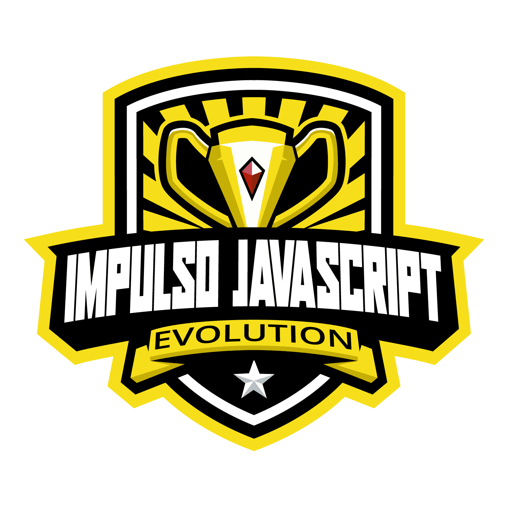

# Bootcamp Impulso Javascript Evolution 

> Este repositório têm a finalidade de documentar todas as atividades e os projetos realizados no Bootcamp Impulso Javascript Evolution. 
>
> O Bootcamp foi organizado pela [Digital Innovation One - DIO](https://web.dio.me/home).

---

### Projetos Integradores 

- [Landing Page - Flex Turismo](01-projetos-integradores/01-landing-page-flex-turismo)

---

### Desafios de código

- [Desafio Inicial - JavaScript](02-desafios-de-codigo/01-desafio-inicial-js)
- [Desafio Intermediário - JavaScript](02-desafios-de-codigo/02-desafio-intermediario-js)

---

### Projetos Desenvolvidos

- [Página inicial do Instagram](03-projetos-desenvolvidos/01-pagina-inicial-do-Instagram)
- [Introdução Prática ao TypeScript](03-projetos-desenvolvidos/02-introducao-pratica-typescript)
- [Front-end com ReactJS](03-projetos-desenvolvidos/03-frontend-reactjs)
- [Integrando um Backend em Node.js com um Frontend em React para um E-commerce](03-projetos-desenvolvidos/04-integrando-backend-com-frontend)

